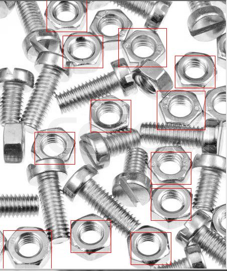

Nuts detector - Quick simulation of Random Bin Picking

### How it works
It is based on the [Dlib](http://dlib.net/) library using SVM (Support Vector Machine) and compiled on Windows platform.
The machine is trained on the training set included in the project directory.

### Usage
train the machine:  
`nuts_detector.exe -tv nuts.xml`   
or directly detect nuts since the svm file is in the project directory:  
`nuts_detector.exe untrained.jpg`

### Improvements
In order to work in a wide range of situations:  
* The training set needs to be much larger (different lighting, orientation, surface on which pieces are, ...)  
* The pictures of the training set must have a better resolution  
* The detection might be improved using a contour operation (such as the one in openCV) but the 3D features of eVisionFactory probably bring more informations to be used to better train the model.

### Note
Training the model with holes of the nuts doesn't improve the result. The holes don't contain enough informations and thrads of the holes can be detected as screws.

# Result
Here is the detection of nuts on an untrained set:  
